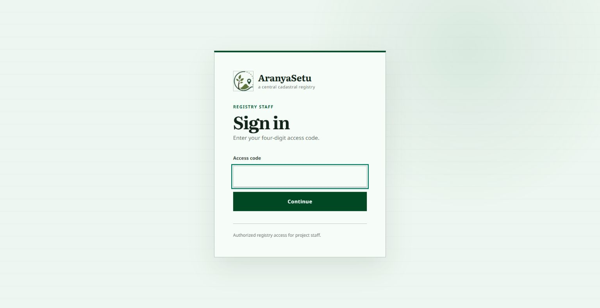
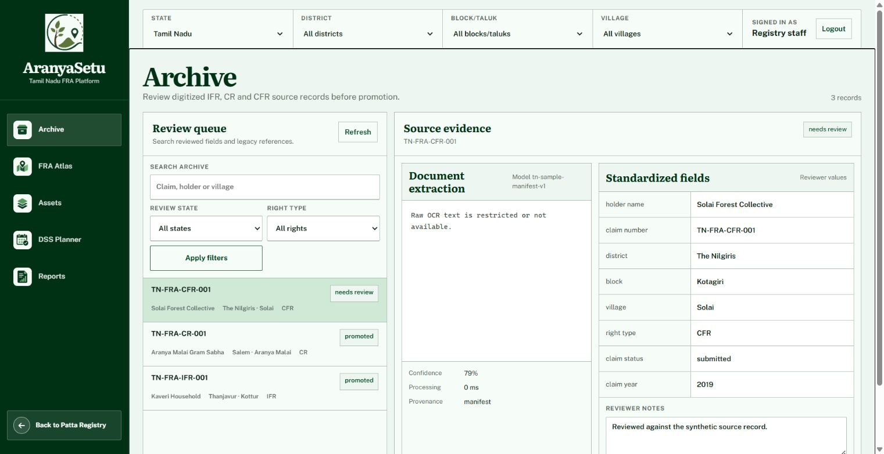
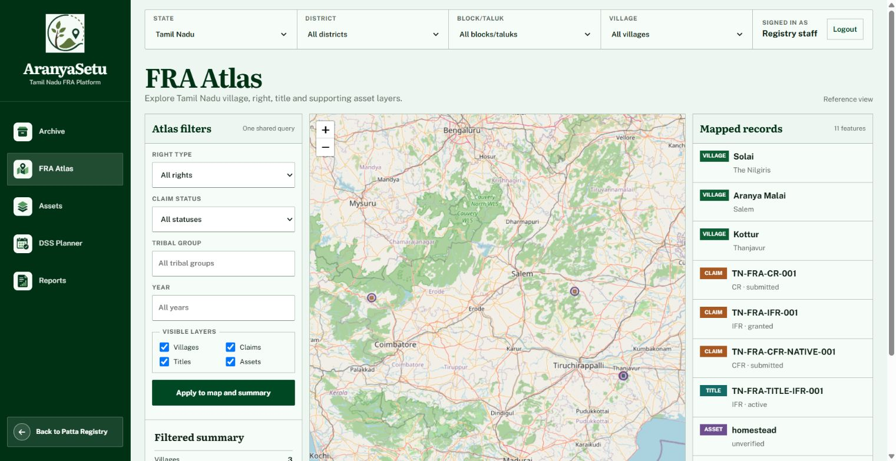
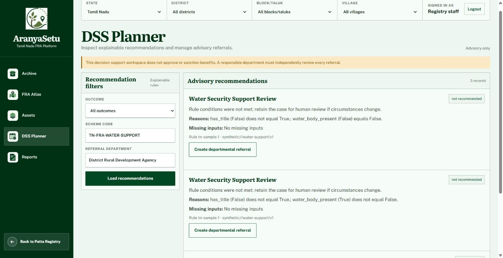

# AranyaSetu

AranyaSetu is an FRA Spatial Intelligence and Decision Support platform for digitizing legacy Forest Rights Act records, managing native FRA cases, spatializing claims and titles, mapping supporting assets, and producing explainable scheme recommendations for authorized staff.

The primary lifecycle is **Ingest → Structure → Spatialize → Enrich → Visualize → Recommend**. FRA claims, verification records, Gram Sabha/SDLC/DLC decisions, titles, villages, geometries, satellite-derived observations, and advisory recommendations are the platform's core records.

Patta OCR and cadastral parcel matching remain available as supporting evidence for FRA spatialization. An ordinary patta is never represented as an FRA title or as proof that an FRA right has been granted.

> [!IMPORTANT]
> This repository is a research prototype, not an FRA adjudication or legal land-ownership system. Extracted records, mapped boundaries, asset observations, and DSS recommendations require review by the responsible authority. Bundled demonstration data is synthetic and must never be presented as authoritative.

## Product tour

AranyaSetu provides a protected, Tamil Nadu-first FRA workflow from legacy intake through Atlas visualization and advisory planning. The screenshots below use the repository's bundled synthetic sample data; they do not show authoritative land or claimant records.

### Secure staff access

The temporary development sign-in keeps the registry and FRA workspaces behind an authenticated staff session. Production deployments must replace this access-code flow with an approved identity provider.



### FRA archive review

The Archive workspace accepts scanned PDF/image batches and existing UTF-8 CSV or XLSX registers. Scans are queued for OCR and entity extraction; each non-empty register row is mapped immediately into the same review queue. The private original, source page or row, source header/value, extraction method, confidence, model/schema version, reviewer correction, and approved value remain linked to each extracted field.

Reference geometry enters a companion staged import through `/api/fra/geospatial/imports`. It accepts GeoJSON, zipped Shapefile, KML, and GeoPackage polygons, validates CRS and geometry, records repair/duplicate provenance, and requires reviewer publication before the features become reference data.



### FRA Atlas

The Atlas synchronizes administrative and rights filters with synthetic village, claim, title, and supporting-asset layers, plus a readable list of the mapped records.



### Explainable DSS planner

The advisory planner shows the rule outcome, reasons, missing inputs, and model provenance before a staff member can create a departmental referral. Recommendations never approve or sanction benefits.



### Supporting cadastral evidence

Where an FRA record needs parcel identification, staff can use the separate cadastral evidence workspace to review survey and subdivision references and compare them with reference parcels. These records enter FRA casework only through the legacy-intake review and normalization controls.

## What the application does

- Models FRA rights holders, Gram Sabhas, claim decisions, versioned geometries, evidence, and titles under `/api/fra/*`.
- Reads legacy FRA JPG, PNG, BMP, TIFF, and PDF documents with PaddleOCR and accepts reviewed CSV/XLSX registers.
- Extracts Tamil and English FRA entities with page-level evidence, confidence, validation warnings, and explicit human correction.
- Imports staged reference vectors and connects reviewed records to native FRA claims, titles, villages, and versioned geometries.
- Evaluates FRA overlaps by right type, ingests bounded Sentinel-2 analysis-ready evidence, and returns versioned advisory DSS recommendations.
- Provides a protected Tamil Nadu-first `/fra` workspace with archive intake/review, native casework, geometry authoring, operational dashboards, synchronized Atlas filters, versioned observations, derived-fact advisory referrals, and privacy-safe printable reports.
- Imports legacy CSV/XLSX registers into row-level archive review while retaining the private source and field-level mapping evidence.
- Imports reviewed reference vectors, evaluates non-adjudicative intersections, discovers bounded allow-listed STAC scenes, and stores versioned historical evidence artifacts without exposing private scene or storage references.
- Keeps OCR, entity extraction, and asset models behind replaceable versioned gateways so trained models can be attached later without changing the legal workflow.
- Retains authenticated cadastral document and parcel-matching tools as supporting evidence for FRA land identification.

## Primary FRA workflow

```text
Sign in
  -> ingest legacy FRA documents and data
  -> OCR and extract structured entities
  -> review and approve normalized values
  -> create or link a native FRA case
  -> spatialize the claim or title
  -> enrich the village with supporting asset observations
  -> visualize the evidence in the FRA Atlas
  -> evaluate advisory scheme rules
  -> review the recommendation and its provenance
```

The cadastral evidence workspace retains revenue/Patta OCR, survey and subdivision matching, and the parcel registry as supporting FRA spatialization tools. Records from that workspace enter FRA casework only through the reviewed legacy-intake and normalization controls.

## Supporting cadastral-link safeguards

The separate cadastral evidence registry prevents duplicate parcel links with several layers of protection:

1. A database unique constraint allows only one claim for a parcel ID.
2. PostgreSQL uses a transaction-scoped advisory lock to serialize availability checks.
3. PostGIS calculates the intersection area between the candidate parcel and every active claimed parcel.
4. Configurable square-metre and percentage thresholds ignore insignificant geometry slivers.
5. A competing request returns `409 Conflict`, records an audit event, and does not create another claim.

SQLite uses Shapely for development-time overlap checks. PostgreSQL/PostGIS is required for production concurrency and spatial behavior.

## Technology

| Area | Implementation |
|---|---|
| Web application and API | FastAPI, Uvicorn |
| OCR | PaddleOCR / PaddlePaddle |
| Image and PDF processing | OpenCV, Pillow, PDFium |
| Database | PostgreSQL 16 with PostGIS; SQLite for lightweight development |
| Spatial processing | PostGIS, GeoAlchemy2, Shapely |
| Persistence | SQLAlchemy and Alembic |
| Private document storage | Local private volume or Amazon S3 |
| Malware scanning | ClamAV INSTREAM |
| Browser UI | Server-hosted HTML, CSS, JavaScript, and Leaflet |
| Optional text enrichment | OpenAI-compatible API client |

## Architecture

```text
Staff browser
  -> FastAPI session and FRA routes
      -> private legacy-record storage
      -> page-level PaddleOCR and FRA entity extraction
      -> reviewer normalization and native FRA case mapping
      -> versioned FRA geometry, evidence, decision, and title records
      -> FRA Atlas and village asset intelligence
      -> explainable DSS and scheme referrals
      -> SQLAlchemy -> PostgreSQL/PostGIS
      -> append-only audit events

Supporting cadastral evidence
  -> authenticated document processing and parcel resolution
      -> reviewed survey/subdivision references for FRA spatialization

Replaceable integrations
  -> OCR, entity extraction, STAC imagery, asset models, and reference datasets
```

The browser UI never stores or displays its signed session token. Parcel responses expose registry geometry and provenance without claimant identifiers or private storage keys. Original cadastral evidence documents, including Pattas, are streamed only through an authenticated, audited endpoint.

## Repository layout

```text
app/
  api/                    FRA, document-intelligence, DSS, and supporting-evidence APIs
  db/                     SQLAlchemy models and session management
  models/                 API request and response models
  services/               FRA workflows, spatial intelligence, OCR, DSS, storage, and audit logic
  static/login/           Temporary staff sign-in page
  static/cadastral-evidence/ Supporting document-to-parcel evidence UI
  utils/                  Upload validation helpers
data/
  administrative_aliases.json
  demo_dss_rules.json
  synthetic_tamil_nadu_fra_archive.json
  synthetic_tamil_nadu_fra_atlas.geojson
  tn_scheme_catalog.sample.json
  synthetic_example_village.geojson
docs/                     Operations, privacy, specifications, and implementation plans
migrations/               Alembic database migrations
scripts/                  Import, user, token, backup, and restore commands
tests/                    Python and browser-logic test suites
docker-compose.yml        API, PostGIS, and ClamAV development stack
Dockerfile                Production-shaped API image
```

## Quick start with Docker Compose

### Prerequisites

- Docker Desktop or Docker Engine with Compose
- At least several gigabytes of free disk space for OCR models and container images
- Internet access during the first build and first OCR model download

### 1. Clone the repository

```bash
git clone <repository-url> aranyasetu
cd aranyasetu
```

### 2. Create the environment file

```bash
cp .env.example .env
```

PowerShell:

```powershell
Copy-Item .env.example .env
```

Generate an authentication secret:

```bash
python -c "import secrets; print(secrets.token_hex(32))"
```

Place the generated value in `.env` as `AUTH_SECRET`. The sample Compose database uses the password `change-me`; if you change it, update both `DATABASE_URL` and the database service password in `docker-compose.yml`.

### 3. Build and start the services

```bash
docker compose up -d --build
docker compose ps
```

The API container waits for PostGIS and ClamAV, applies Alembic migrations, and then starts Uvicorn on port `8000`. After API readiness, the separate worker starts polling durable FRA jobs. Each running job has a renewable lease; interrupted work is recovered and retried with bounded backoff, while permanent failures are quarantined for reviewer action.

### 4. Import development reference data

```bash
docker compose exec api python -m scripts.import_aliases data/administrative_aliases.json
docker compose exec api python -m scripts.import_parcels data/synthetic_example_village.geojson
```

The GeoJSON file contains 52 synthetic parcels, including irregular shapes used to exercise realistic boundaries. Imports are idempotent and report inserted, updated, skipped, invalid, duplicate, and repaired records.

### 5. Open the application

- Staff login: <http://localhost:8000/login>
- Tamil Nadu FRA workspace: <http://localhost:8000/fra>
- API documentation: <http://localhost:8000/docs>
- Liveness: <http://localhost:8000/health>
- Database readiness: <http://localhost:8000/health/ready>

For the local sample configuration, sign in with access code `1234` or the value assigned to `DEMO_ACCESS_CODE`.

Seed the complete invented Tamil Nadu FRA story after migrations:

```bash
docker compose exec api python -m scripts.seed_tamil_nadu_fra_demo
```

The Compose worker processes the seeded queue automatically. For a bounded local worker run outside Compose, use `python -m scripts.run_fra_jobs --max-jobs 20`.

The seed is idempotent and includes three synthetic village profiles, IFR/CR/CFR archive examples, claims and versioned geometry, a synthetic title, time-separated supporting observations, non-authoritative Tamil Nadu scheme-catalogue drafts, and advisory rule/referral examples. It is not authoritative case data. Trained models are optional and can be attached later using [the model adapter guide](docs/MODEL_ADAPTERS.md).

Run the limited Villupuram pilot with real public geographic and Sentinel-2
context, explicit synthetic claim fixtures, and a truthful model placeholder:

```powershell
docker compose exec api python -m scripts.seed_tamil_nadu_fra_pilot
```

The command emits a machine-readable status for every stage from legacy FRA
intake through scheme convergence. See [the Tamil Nadu pilot guide](docs/TAMIL_NADU_PILOT.md)
for the exact provenance and expected `awaiting_user_model` and
`insufficient_data` states.

### Stop the stack

```bash
docker compose down
```

Named volumes preserve the database, private uploads, ClamAV definitions, and downloaded Paddle models. `docker compose down -v` also deletes those volumes and their data; use it only when a full reset is intended.

## Local development without the full stack

### Prerequisites

- Python 3.11
- A C/C++ runtime supported by PaddlePaddle
- Node.js 18 or newer only for the browser-logic tests
- PostgreSQL/PostGIS for production-like spatial testing, or SQLite for lightweight local testing

Create and activate a virtual environment:

```bash
python -m venv venv
source venv/bin/activate
python -m pip install -r requirements-dev.txt
```

PowerShell activation:

```powershell
python -m venv venv
.\venv\Scripts\Activate.ps1
python -m pip install -r requirements-dev.txt
```

For a SQLite development run, create `.env` with at least:

```dotenv
ENVIRONMENT=development
DATABASE_URL=sqlite+pysqlite:///./aranyasetu.db
AUTH_SECRET=replace-with-a-long-random-development-secret
DEMO_AUTH_ENABLED=true
DEMO_ACCESS_CODE=1234
DEMO_SESSION_MINUTES=480
SECURE_UPLOAD_DIR=private_uploads
MALWARE_SCAN_REQUIRED=false
CLAMAV_HOST=
```

Apply the schema, import the synthetic registry, and start the server:

```bash
alembic upgrade head
python -m scripts.import_aliases data/administrative_aliases.json
python -m scripts.import_parcels data/synthetic_example_village.geojson
uvicorn app.main:app --reload --host 0.0.0.0 --port 8000
```

The first OCR request can take longer because PaddleOCR may download and initialize its models.

## Authentication

### Temporary browser login

`POST /api/auth/demo-login` validates the configured four-digit access code, creates or updates the `registry-demo` database user with the `reviewer` role, and returns an HttpOnly session cookie. This lets local registry staff use the review queues bundled with the synthetic Tamil Nadu sample. The cookie is `SameSite=Strict` and becomes `Secure` when `ENVIRONMENT=production`.

The access-code authentication is intentionally temporary. Before a real deployment:

- disable `DEMO_AUTH_ENABLED`;
- replace the local HS256 adapter with the authority's OIDC verifier;
- provision staff identities and roles from the trusted identity system;
- rotate `AUTH_SECRET` and invalidate temporary sessions.

### Bearer-token development access

Protected APIs also accept `Authorization: Bearer <JWT>`. The JWT subject must match a row in `users.external_id`; roles are read from the database and are not trusted from token claims.

```bash
python -m scripts.create_user alice --display-name "Alice" --role user
python -m scripts.mint_dev_token alice --minutes 60
```

These scripts are for local development, not production identity management.

## API overview

### Document intelligence and supporting extraction routes

| Method | Route | Purpose |
|---|---|---|
| `GET` | `/health` | Process liveness check |
| `GET` | `/health/ready` | Database readiness check |
| `POST` | `/api/fra/document-intelligence/ocr` | Digitize an FRA or supporting image/PDF; optionally analyze it |
| `POST` | `/api/fra/document-intelligence/evaluate` | Compare OCR text with verified reference text |
| `POST` | `/api/cadastral-evidence/text/extract` | Extract evidence-backed land fields from reviewed OCR text |
| `POST` | `/api/cadastral-evidence/documents/extract` | Digitize and optionally enrich a supporting land record |

The document-intelligence OCR route does not require an LLM key. It returns extracted text, average model confidence, and review signals for dates, areas, survey references, and mixed-script tokens. Model confidence is not measured textual or factual accuracy. Earlier `/ocr`, `/evaluate`, `/land/extract`, and `/ocr/land` paths remain compatibility aliases and are omitted from the generated API catalogue.

### Browser and session routes

| Method | Route | Purpose |
|---|---|---|
| `GET` | `/` | Redirect to staff login |
| `GET` | `/login` | Temporary staff sign-in page |
| `GET` | `/cadastral-evidence` | Supporting cadastral evidence workspace |
| `GET` | `/land-mapping` | Compatibility redirect to `/cadastral-evidence` |
| `POST` | `/api/auth/demo-login` | Start a temporary staff session |
| `GET` | `/api/auth/session` | Return the signed-in staff identity |
| `POST` | `/api/auth/logout` | Clear the browser session |

### Supporting cadastral evidence routes

| Method | Route | Purpose |
|---|---|---|
| `POST` | `/api/cadastral-evidence/documents/process` | Validate, scan, privately store, digitize, extract, and attempt parcel resolution |
| `POST` | `/api/cadastral-evidence/parcels/resolve` | Resolve staff-corrected fields and persist valid candidate IDs |
| `GET` | `/api/cadastral-evidence/parcels/{parcel_id}` | Return privacy-safe parcel metadata and GeoJSON geometry |
| `POST` | `/api/cadastral-evidence/parcel-links` | Record an available document-to-parcel link or return `409` on a conflict |
| `GET` | `/api/cadastral-evidence/parcel-links` | Return persistent parcel links, summaries, and source-document view URLs |
| `GET` | `/api/cadastral-evidence/parcel-links/{link_id}/source-document` | Stream the authenticated supporting source document |
| `GET` | `/api/cadastral-evidence/parcel-links/mine` | Return the current user's parcel links |
| `GET` | `/api/cadastral-evidence/notifications/mine` | Return the current user's cadastral evidence notifications |

The document-processing and parcel-link endpoints require an `Idempotency-Key` header. Repeating a successful request with the same user and key returns the existing result instead of creating a duplicate. Earlier `/api/pattas`, `/api/parcels`, and `/api/claims` paths remain compatibility aliases but are omitted from the generated API catalogue.

### Legacy conflict-review routes

| Method | Route | Access |
|---|---|---|
| `GET` | `/api/admin/conflicts` | Administrator |
| `GET` | `/api/admin/conflicts/{conflict_id}` | Administrator |
| `PATCH` | `/api/admin/conflicts/{conflict_id}` | Administrator |

These routes support historical conflict records. New competing claims are rejected by the exclusive-claim gate instead of creating a second claim and conflict record.

### Protected FRA foundation routes

The `/api/fra/*` domain covers rights holders, Gram Sabhas, IFR/CR/CFR claims, versioned geometry and evidence, reviewer-controlled transitions and titles, legacy promotion, right-aware spatial evaluation, supporting satellite observations, and explainable DSS recommendations. It is backward-compatible with the legacy routes above.

Satellite observations are supporting evidence and do not determine legal validity. DSS recommendations are advisory and do not approve or sanction benefits. See the [FRA foundation guide](docs/FRA_FOUNDATION.md) for routes, roles, imagery processing, scheme rules, and limitations.

The connected operational routes additionally provide archive batch ingestion, registry-to-FRA intake, native case workspaces, vector staging/publication, imagery jobs and reports, verified fact derivation, versioned scheme catalogue entries, and privacy-minimized verifier/planner dashboards. The Atlas exposes imagery coverage and thematic reference layers with synchronized hierarchy, right, lifecycle, year, category, and area filters.

## API examples

### FRA document digitization

```bash
curl -X POST http://localhost:8000/api/fra/document-intelligence/ocr \
  -F "file=@/path/to/fra-record.png"
```

Supported extensions are `jpg`, `jpeg`, `png`, `bmp`, `tif`, `tiff`, and `pdf`. The default upload limit is 10 MB.

### OCR evaluation

```bash
curl -X POST http://localhost:8000/api/fra/document-intelligence/evaluate \
  -F "reference_text=Survey No. 614/1B" \
  -F "ocr_text=Survey No. 614/IB"
```

The response reports character error rate, word error rate, and exact-match accuracy for critical numeric, date, survey, and survey-area fields.

### Authenticated browser-style request

```bash
curl -c cookies.txt \
  -H "Content-Type: application/json" \
  -d '{"access_code":"1234"}' \
  http://localhost:8000/api/auth/demo-login

curl -b cookies.txt \
  -H "Idempotency-Key: upload-example-1" \
  -F "file=@/path/to/revenue-record.png" \
  http://localhost:8000/api/cadastral-evidence/documents/process
```

## OCR and parcel matching behavior

### Extraction

- Images narrower than `MIN_IMAGE_WIDTH` are enlarged before recognition.
- PDFs are rasterized at `PDF_DPI` and processed page by page.
- The default recognizer is the Tamil PP-OCRv5 mobile model.
- Tamil table extraction recognizes survey/subdivision rows such as `614` and `1B`, plus hectare-are extents such as `0 - 5.00`.
- `H.A.SqM`, hectares, acres, cents, and square metres are normalized to square metres.
- Ambiguous characters such as `B/8` and `O/0` remain alternatives requiring human confirmation.
- Every extracted field keeps its supporting OCR evidence when available.

### Parcel lookup

A survey number is not globally unique. Exact lookup requires:

```text
state + district + taluk + village + survey number + subdivision number
```

Verified administrative aliases are normalized before lookup. A close village spelling can be suggested, but it is never silently accepted. Area differences generate warnings and do not invent a parcel location.

### Cadastral boundaries

The importer accepts GeoJSON `Polygon` and `MultiPolygon` features, converts them to `MultiPolygon`, attempts safe repair of invalid polygonal geometry, and upserts on the full parcel key. Every authoritative record should retain `source`, `source_version`, and `source_record_id`.

Run an import with:

```bash
python -m scripts.import_parcels /path/to/parcels.geojson
```

## Configuration reference

Environment variables are loaded from `.env`. Environment values override application defaults.

### Core and OCR

| Variable | Application default | Purpose |
|---|---:|---|
| `APP_NAME` | `AranyaSetu` | FastAPI application name |
| `ENVIRONMENT` | `development` | Enables production safeguards when set to `production` |
| `LOG_LEVEL` | `INFO` | Application log level |
| `MAX_FILE_SIZE_MB` | `10` | Maximum upload size |
| `ALLOWED_EXTENSIONS` | JPG, PNG, BMP, TIFF, PDF | Accepted upload extensions |
| `MIN_IMAGE_WIDTH` | `1200` | Width below which images are enlarged |
| `PDF_DPI` | `300` | PDF rasterization resolution |
| `PADDLEOCR_DETECTION_MODEL_NAME` | `PP-OCRv5_mobile_det` | Text detection model |
| `PADDLEOCR_RECOGNITION_MODEL_NAME` | `ta_PP-OCRv5_mobile_rec` | Text recognition model |
| `PADDLEOCR_DET_MODEL_DIR` | unset | Optional local detection model directory |
| `PADDLEOCR_REC_MODEL_DIR` | unset | Optional local recognition model directory |

### Registry, authentication, and storage

| Variable | Application default | Purpose |
|---|---:|---|
| `DATABASE_URL` | SQLite database in the project directory | SQLAlchemy database URL |
| `AUTH_SECRET` | insecure development placeholder | HS256 development/session signing secret |
| `AUTH_ISSUER` | `aranyasetu` | Required token issuer |
| `AUTH_AUDIENCE` | `aranyasetu-api` | Required token audience |
| `DEMO_AUTH_ENABLED` | `true` | Enable the temporary access-code login |
| `DEMO_ACCESS_CODE` | `1234` | Temporary local access code |
| `DEMO_SESSION_MINUTES` | `480` | Temporary session lifetime |
| `SECURE_UPLOAD_DIR` | `private_uploads` | Local private document root |
| `UPLOAD_STORAGE_BACKEND` | `local` | `local` or `s3` |
| `S3_BUCKET` | empty | Required for S3 storage |
| `S3_PREFIX` | `fra-evidence` | Private S3 object prefix |
| `CLAMAV_HOST` | empty | ClamAV host; omitted scanning is allowed only outside fail-closed mode |
| `CLAMAV_PORT` | `3310` | ClamAV daemon port |
| `MALWARE_SCAN_REQUIRED` | `false` | Reject uploads if scanning is unavailable |

### Matching, overlap, limits, and optional enrichment

| Variable | Application default | Purpose |
|---|---:|---|
| `AREA_TOLERANCE_PERCENT` | `10` | Warn when document and official area differ beyond this percentage |
| `AUTOMATIC_MATCH_CONFIDENCE` | `0.85` | Minimum confidence for an automatic match |
| `OVERLAP_MIN_SQM` | `1` | Minimum intersection area treated as a conflict |
| `OVERLAP_MIN_PERCENT` | `1` | Minimum intersection percentage of the smaller parcel |
| `RATE_LIMIT_REQUESTS` | `60` | Protected requests allowed per identity/window |
| `RATE_LIMIT_WINDOW_SECONDS` | `60` | In-process rate-limit window |
| `LLM_API_KEY` | empty | Enables optional prompt and contextual enrichment |
| `LLM_BASE_URL` | Groq OpenAI-compatible endpoint | OpenAI-compatible API base URL |
| `LLM_MODEL_NAME` | `openai/gpt-oss-120b` | Provider model identifier |

When `ENVIRONMENT=production`, startup rejects a default/short `AUTH_SECRET`, SQLite, or disabled fail-closed malware scanning.

## Testing

Run the complete Python suite:

```bash
python -m pytest -q
```

Run the dependency-free browser-logic suite:

```bash
node --test tests/cadastral_evidence_ui.test.js
```

Useful focused checks:

```bash
python -m pytest -q tests/test_cadastral_extraction.py tests/test_parcel_resolver.py
python -m pytest -q tests/test_cadastral_link_eligibility.py tests/test_cadastral_link_service.py
python -m pytest -q tests/test_cadastral_evidence_api.py tests/test_cadastral_evidence_ui.py
python -m pytest -q tests/test_migrations.py tests/test_production_safeguards.py
```

## Security and privacy boundaries

- Uploaded registry documents are stored outside the public static directory.
- Local paths are resolved beneath the configured private root; S3 keys are constrained to the configured prefix.
- Cadastral source-document responses are authenticated, use `Cache-Control: private, no-store`, and are audited.
- File extension, MIME signature, size, filename, and decodability are validated.
- Production uploads fail closed when ClamAV is unavailable.
- Registry responses exclude claimant IDs and private storage keys.
- JWT issuer, audience, timestamps, signature, and database-backed subject are validated.
- Database roles, not token role claims, determine administrator access.
- Request IDs are returned and written to metadata-only access logs.
- Raw OCR text, document content, access tokens, and signed storage URLs must not be logged.

See [Privacy and retention](docs/PRIVACY_RETENTION.md) for the baseline data policy.

## Production checklist

Before using this system with real records:

- Replace the temporary access code with an approved OIDC identity provider.
- Use PostgreSQL/PostGIS and apply all Alembic migrations.
- Import licensed, authoritative cadastral boundaries with provenance.
- Remove synthetic parcels from the user-facing database.
- Enable fail-closed malware scanning.
- Use managed secrets and rotate all temporary credentials.
- Terminate TLS at a trusted ingress.
- Encrypt database, object storage, and backups at rest.
- Use private S3 or an equivalently controlled document store.
- Replace the in-process rate limiter when running multiple API replicas.
- Establish the approved retention period, legal hold, access/export, and erasure processes.
- Test backup restoration in an isolated environment.
- Obtain security, privacy, accessibility, and legal review.

See [Operations](docs/OPERATIONS.md) for monitoring, backup, restore, import, and incident-response guidance.

## Troubleshooting

### The API exits during startup

With `ENVIRONMENT=production`, verify that `AUTH_SECRET` contains at least 32 non-default characters, `DATABASE_URL` points to PostgreSQL/PostGIS, and `MALWARE_SCAN_REQUIRED=true`.

### OCR initialization fails or the first request is slow

Confirm that PaddlePaddle is supported on the host and that the container can download the configured models. Docker Compose preserves downloads in the `paddle_models` volume. Local model directories can be supplied with `PADDLEOCR_DET_MODEL_DIR` and `PADDLEOCR_REC_MODEL_DIR`.

### Extracted fields remain blank

OCR confidence does not guarantee that the required parcel fields were recognized. Check image clarity and rotation, then use **Show OCR sources** and correct the fields manually. Parcel resolution still requires the full administrative and survey key.

### The parcel is not found in the registry

Confirm that reference data was imported and that state, district, taluk, village, survey number, and subdivision match the registry record. The application does not geocode a place name or invent a polygon when the cadastral record is absent.

### Claim registration returns `409`

This is expected when the parcel already has a supporting link or its polygon materially overlaps an active parcel link. Inspect the existing entry in the **Parcel registry** view instead of recording another link.

### A stored cadastral evidence document cannot be opened

Check that the private upload volume or S3 object still exists and that the current process uses the same `SECURE_UPLOAD_DIR` or S3 configuration used when the document was registered.

## Additional documentation

- [Architecture and implementation guide](docs/ARCHITECTURE.md)
- [Operations guide](docs/OPERATIONS.md)
- [Privacy and retention baseline](docs/PRIVACY_RETENTION.md)
- [Forest Rights Act foundation](docs/FRA_FOUNDATION.md)
- [Model adapter contracts](docs/MODEL_ADAPTERS.md)
- [Tamil Nadu pilot and provenance](docs/TAMIL_NADU_PILOT.md)
- [Ordered project demonstration flow](docs/DEMO_FLOW.md)
- [Final priority outcome audit](docs/FINAL_OUTCOME_AUDIT.md)
- [Implementation checklist](docs/IMPLEMENTATION_CHECKLIST.md)

## License

No license file is currently included. Treat the repository as all rights reserved until the project owner adds an explicit license.
