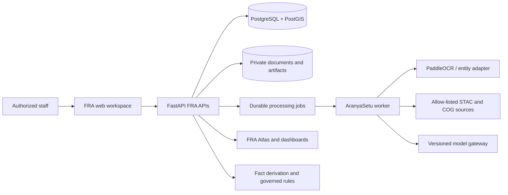

# AranyaSetu architecture and implementation guide

This guide describes the implemented FRA-centred platform as of migration
`20260906_0013`. It is the technical reference for the current data flow,
trust boundaries, and known limitations. Historical plans under
`docs/superpowers/` and `docs/archive/` record earlier design work and do not
override this guide.

## Problem and scope

The Forest Rights Act workflow depends on legacy IFR, CR, and CFR records that
are often held as scans, local registers, and disconnected spatial files.
AranyaSetu turns those inputs into reviewable structured records, connects them
to native FRA cases and village geography, presents them in an FRA Atlas, adds
satellite and asset evidence, and derives versioned facts for advisory scheme
convergence.

The primary journey is:

```text
legacy FRA records -> structured FRA data -> spatial FRA records -> FRA Atlas
                   -> satellite asset intelligence -> DSS/scheme convergence
```

Cadastral and Patta documents are supporting evidence for land identification,
survey/subdivision matching, and spatialization. They are not FRA titles and do
not establish an FRA right.

## System architecture

AranyaSetu is a FastAPI modular monolith with a server-hosted JavaScript UI, a
separate durable-job worker, PostgreSQL/PostGIS persistence, private document
storage, and ClamAV upload scanning.



HTTP modules are grouped by FRA archive, case lifecycle, Atlas, geospatial
imports, asset intelligence, planning/reports, operations, document
intelligence, and supporting cadastral evidence. Earlier OCR and Patta-named
URLs remain undocumented compatibility aliases.

## Data model

The model has four connected record groups:

| Group | Principal records | Role |
| --- | --- | --- |
| Native FRA | `RightsHolder`, `GramSabha`, `FRAClaim`, `FRADecision`, `FRAGeometryVersion`, `FRAEvidenceItem`, `FRATitle` | Authoritative workflow structure with append-only decisions and versioned geometry/title history |
| Legacy digitization | `FRAImportBatch`, `FRAArchiveRecord`, `FRAExtractionRun`, `FRAFieldReview`, `FRAIntakeItem` | Source preservation, OCR/entity output, human review, and controlled promotion |
| Spatial and assets | `FRAVillageProfile`, `SpatialImportBatch`, `SpatialReferenceFeature`, `ImagerySceneRecord`, `ImageryArtifact`, `InferenceRun`, `AssetFeature`, `VillageAssetProfile` | Village/reference layers, imagery provenance, model observations, and profile aggregates |
| DSS and operations | `DSSFactSnapshot`, `SchemeCatalogEntry`, `SchemeRuleSet`, `DSSRecommendation`, `DSSReferral`, `ProcessingJob`, `ReportArtifact`, `AuditEvent`, `ModelVersion` | Versioned facts, governed rules, advisory outcomes, referrals, job safety, reports, and audit history |

`FRAClaim` is the native rights record. The older `Claim`, `Parcel`, `Document`,
and `OCRResult` tables support the cadastral evidence compatibility workflow.
Legacy records enter a native case only through review and promotion; a
cadastral parcel link cannot bypass the FRA lifecycle.

## Legacy ingestion pipeline

The Case Management legacy workspace accepts batches of scanned images/PDFs
and UTF-8 CSV/XLSX registers. Scanned documents are malware checked, stored
privately, and queued. Tabular rows enter the same archive review model with the
sheet, row, source header, and raw value retained.

```text
batch source context
  -> file/register validation and private storage
  -> archive record
  -> OCR and FRA entity extraction, or tabular header mapping
  -> field-by-field human correction and approval
  -> village/holder/cadastral candidate matching
  -> explicit promotion to a native IFR/CR/CFR case
```

GeoJSON, zipped Shapefile, KML, and GeoPackage inputs use a separate staged
geospatial import. CRS, polygonal type, geometry validity, repairs, duplicates,
source authority, licence, and version are checked before reviewer publication.

## OCR and FRA entity extraction

Images are decoded and preprocessed with OpenCV. PDFs are rendered page by page
with PDFium. PaddleOCR produces text plus page lines, confidence, and bounding
boxes. The FRA extractor recognizes Tamil and English holder/community names,
village and administrative units, right type, lifecycle/decision status,
authority and date, claim/title references, survey/subdivision references,
coordinates, and unit-backed land areas.

Each populated field retains its source page or row, extraction method, model
and schema version, confidence, evidence text, validation warnings, reviewer
state, correction, and final approved value. Conflicting or invalid values
remain unset for review. OCR confidence is model confidence, not measured
factual accuracy. A versioned REST adapter may replace the built-in extractor
only when its output passes the same evidence and validation contract.

## Spatial architecture

Production geometry is stored in PostGIS as EPSG:4326 `MultiPolygon` values
with GIST indexes. Claim boundaries are versioned; asset observations support
point and polygon geometry. Area calculations use PostGIS geography in
production and a local projected Shapely calculation in SQLite tests.

Canonical village boundaries, claims, active titles, reference features,
imagery footprints, and assets are connected through explicit foreign keys and
spatial intersection. IFR-to-IFR material overlap is blocked; CR/CFR overlap is
reported for human review because community rights may be layered. Spatial
findings never change legal status automatically.

Published forest, protected-area, forest-compartment, water, groundwater,
infrastructure, cadastral, and administrative features remain supporting
reference layers with source provenance.

## Satellite intelligence

A spatial FRA claim can queue bounded Sentinel-2 L2A ingestion. The worker uses
allow-listed Earth Search STAC discovery, cloud filtering, required-band
selection, and public Cloud-Optimized GeoTIFF range reads. It aligns and clips
bands to the current claim boundary and stores a private analysis-ready TIFF
with checksum, CRS, transform, valid-pixel count, acquisition date, collection,
licence, and processor provenance.

Historical evidence uses its own bounded STAC/model path and review lifecycle.
Provider URLs, signed query parameters, and private storage keys are redacted
from normal API responses.

Asset detection is intentionally `awaiting_user_model`. The production adapter
boundary accepts a registered model artifact, label map, preprocessing
contract, version, checksum, metrics, and runtime configuration. No synthetic
detections substitute for the missing trained model. See
[`MODEL_ADAPTERS.md`](MODEL_ADAPTERS.md).

## Asset taxonomy and village profiles

All new observations use `fra-assets-v1`:

| Canonical class | Typical source labels |
| --- | --- |
| `agricultural_land` | cropland, farm |
| `water_body` | pond, stream, borewell |
| `homestead` | dwelling, settlement |
| `forest_cover` | woodland, canopy |
| `road` | road, track |
| `infrastructure` | school, health centre, utility |
| `other_asset` | reviewed observation outside the six specific classes |

Source labels remain as `asset_subtype`. Reviewers approve or reject each
observation with optimistic version checks. `village-assets-v2` profiles count
only reviewed evidence and report agricultural/forest area, water and
homestead counts, road/infrastructure availability, confidence, observation
dates, FRA-area intersection/nearby relations, linked claim/title counts, and
explicit observation gaps.

## FRA Atlas

The protected Atlas combines canonical administrative boundaries and villages,
spatial IFR/CR/CFR claims, active titles, reviewed assets, analysis-ready
imagery coverage, and published supporting reference layers. A shared query
applies state, district, block, village, right type, lifecycle status,
tribal/community category, year, and area filters to both features and summary
statistics.

Statistics include all structured cases in scope, including cases without
geometry, and report IFR/CR/CFR counts, granted/rejected/pending outcomes,
claimed area, title-granted area, and state/district/block/village progress.
Authorized claim/title features open the corresponding evidence and decision
record. Private people, source keys, and provider URLs are not Atlas fields.

## DSS and scheme rules

Fact derivation emits the versioned `fra-dss-facts-v1` contract. Facts cover FRA
title/case context, water and homestead observations, agricultural and forest
coverage, groundwater/water stress, road and infrastructure availability,
village context, and FRA-linked asset coverage. Every fact carries an evidence
envelope, source entity/version, observation time, and freshness state.

Rules separate eligibility conditions, required evidence, required assets,
exclusions, priorities, freshness windows, and outcome text. Evaluation returns
`recommended`, `not_recommended`, or `insufficient_data` with reasons, missing
facts/assets, stale evidence, matched priority, and the exact fact/rule/catalogue
versions.

An executable rule must link to an active, authoritative `SchemeCatalogEntry`
whose approval and effective dates cover the rule. Bundled PM-KISAN, MGNREGA,
PMAY-G, JJM, and DAJGUA entries are draft examples unless an authorized
department supplies and activates official metadata. A recommendation is an
advisory review candidate; it is never an eligibility, approval, or sanction
decision.

## Security and authorization

Browser access uses an HttpOnly, SameSite session cookie. Protected APIs also
accept a signed bearer token whose subject must exist in the database; roles
come from the database. Owners see their cases, while reviewer/admin roles can
perform extraction approval, legacy promotion, lifecycle decisions, title
issuance, spatial publication, asset review, model activation, and referrals as
defined by each route.

Uploads are size/type/signature validated, decoded, malware scanned in
production, and stored outside public static files. Normal responses exclude
rights-holder external references, raw OCR, private source paths, storage keys,
model endpoints, and signed satellite URLs. Production startup requires
PostgreSQL/PostGIS, fail-closed malware scanning, and a non-default signing
secret. The demo access code is a local adapter and must be replaced by the
authority's identity provider.

## Provenance

Provenance is retained at each transition:

- source office, source type, authority, licence, version, checksum, and import batch;
- document page or register sheet/row/header/raw value;
- OCR/entity/model name, version, confidence, evidence span, and processing time;
- correction, reviewer identity, review state, and timestamp;
- geometry version, spatial method, reference feature, and computed finding;
- imagery scene, acquisition, bands, processor, artifact checksum, and quality;
- asset taxonomy/model version, geometry, confidence, and review disposition;
- DSS fact source/version, rule version, catalogue version, reasons, and referral.

Audit events contain actor, action, entity, request ID, and metadata changes.
They do not copy raw documents or private source content.

## Deployment and operations

Docker Compose runs the `aranyasetu` project with PostGIS, ClamAV,
`aranyasetu-api:local`, and `aranyasetu-worker:local`. The API applies Alembic
migrations on startup; the worker leases jobs with PostgreSQL `SKIP LOCKED`,
renews heartbeats, fences expired owners, retries with bounded backoff, and
quarantines terminal failures. Private uploads and model downloads use named
volumes. The current migration head is `20260906_0013`.

Use [`OPERATIONS.md`](OPERATIONS.md) for startup, monitoring, backup, restore,
and incident procedures; use [`PRIVACY_RETENTION.md`](PRIVACY_RETENTION.md) for
data-handling controls.

## Current limitations

- The repository contains no user-supplied trained asset detector; that stage remains `awaiting_user_model`.
- The public validation bundle has a real Tamil Nadu village boundary, state totals, and sanitized Sentinel-2 metadata, but no publishable claim-level FRA documents, legal title geometries, or claimant records.
- The pilot therefore uses clearly labelled synthetic FRA case/document and inset geometry fixtures; it never expands public aggregates into invented people or legal cases.
- Bundled scheme catalogue and rule examples are not official eligibility policy. Operational activation requires an authorized source and approver.
- The access-code sign-in, local HS256 tokens, in-process rate limiter, and local storage adapter are development components.
- OCR/NER, spatial findings, imagery, assets, and DSS output all require human review and domain validation before operational use.
- Production release still requires authoritative reference licensing, identity integration, security/privacy/accessibility review, model evaluation and bias review, retention approval, and tested disaster recovery.
